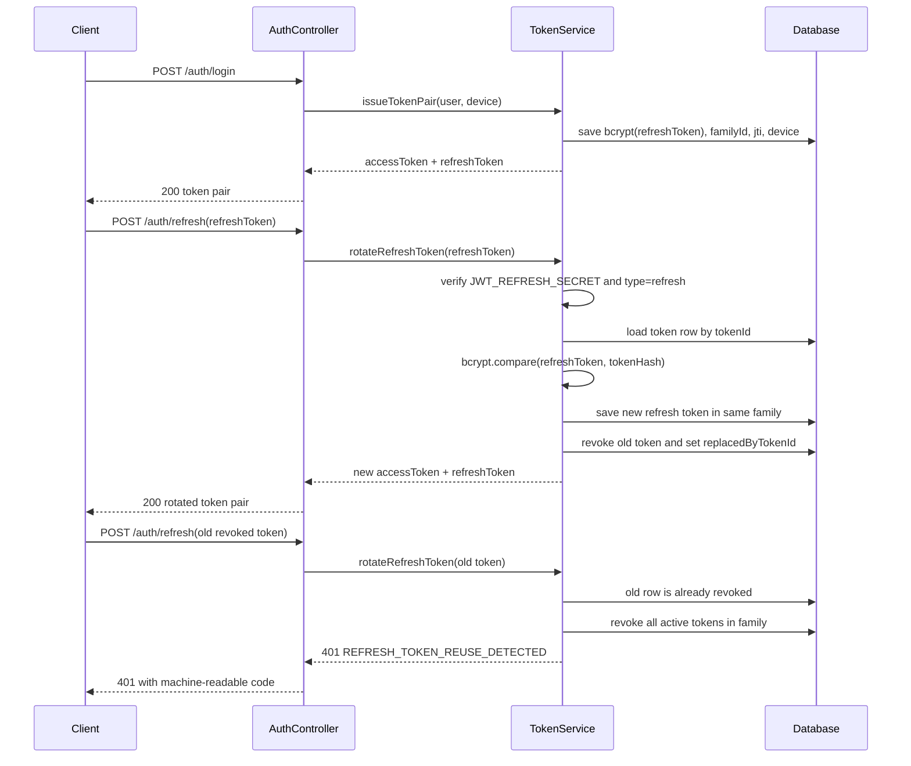

# Auth Refresh Token Flow

This API issues short-lived access tokens and rotating refresh tokens.
Access tokens expire after 15 minutes. Refresh tokens expire after 7 days and
are stored only as bcrypt hashes.

## Token Claims

Both JWT types include:

- `sub`: user id
- `email`: user email
- `jti`: unique token id
- `type`: `access` or `refresh`
- `iat`: issued-at timestamp
- `exp`: expiration timestamp

Refresh tokens also include `familyId` and `tokenId` so the backend can rotate
and revoke a per-device token family.

## Sequence

## Session Endpoints

- `POST /auth/logout` revokes the submitted refresh token only.
- `POST /auth/logout-all` revokes all active refresh tokens for the current user.
- `GET /auth/sessions` lists active device sessions without hashes or raw tokens.
- `DELETE /auth/sessions/:id` revokes one session belonging to the current user.

Password updates revoke all active refresh sessions for that user.
